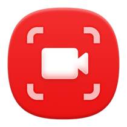
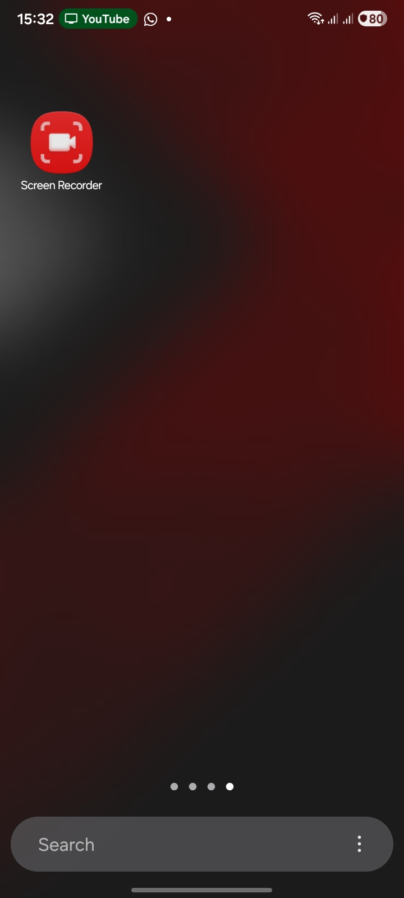

  
  <h1>ScreenRecorder</h1>
  
<b>A pristine Android screen recorder with a floating OneUI-style control pill.</b>

   
  

    
    
    
    
  

 

A lightweight, native Android screen recording application built with Kotlin. It leverages Android's `MediaProjection` API and provides a beautiful, non-intrusive floating pill overlay inspired by Samsung's One UI 8.5 design language, allowing quick toggles for the microphone and internal device audio.

## ✨ Features

- **Native Performance**: Built entirely in Kotlin for maximum efficiency.
- **One UI 8.5 Aesthetic**: Features a frosted-glass, draggable floating control pill.
- **Quick Settings Tile**: Start and stop recordings instantly from your status bar.
- **Dynamic Audio Control**: Effortlessly toggle microphone and internal device audio capturing.
- **Automatic Organization**: Automatically saves your high-quality MP4 recordings directly to: `📁 Internal Storage / DCIM / ScreenRecorder /`

## 🛠️ Build Requirements

- Android Studio
- Android SDK 34 (Target Sandbox)
- Minimum SDK 26 (Android 8.0)
- Gradle 8.5 / Java 21

## 📜 License

This project is licensed under the MIT License.
