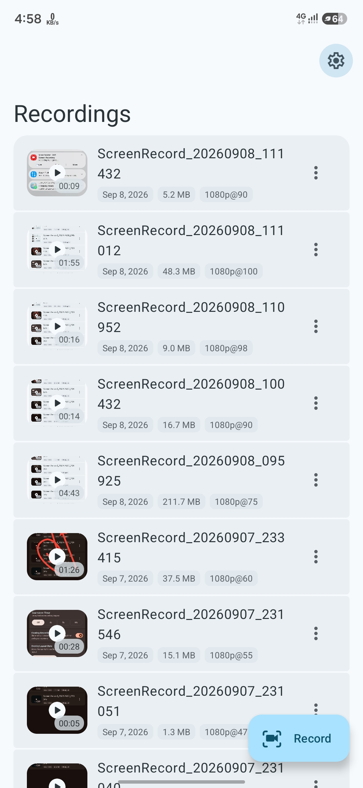
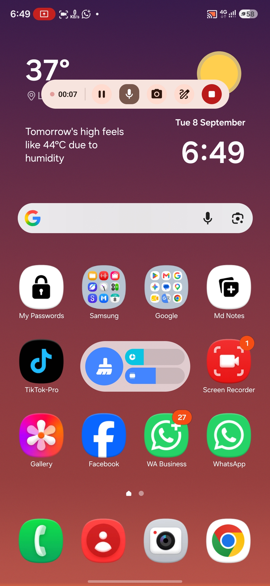
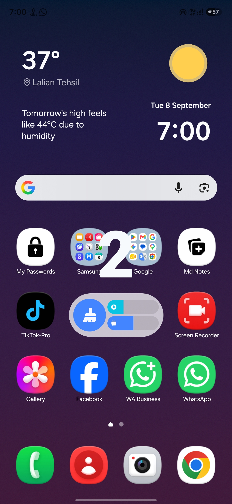
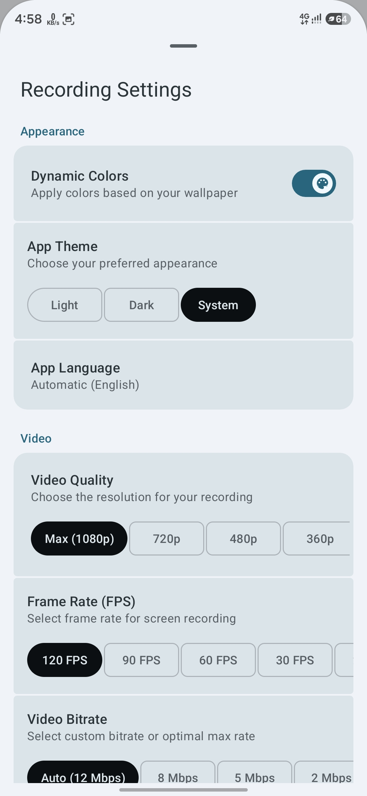
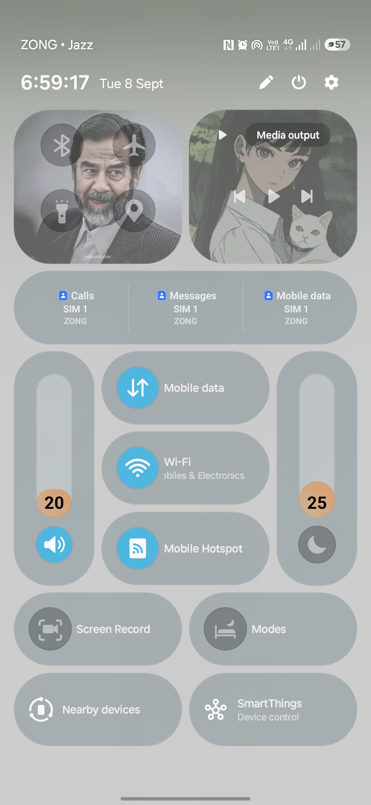
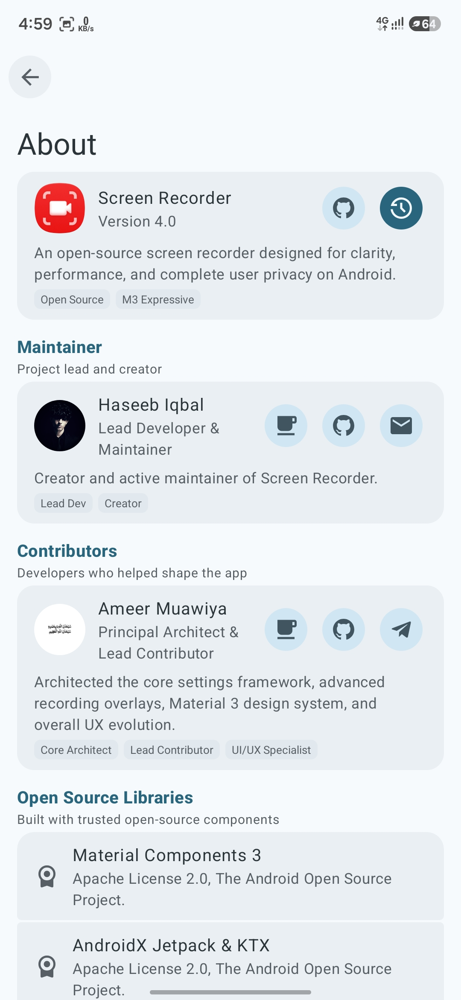
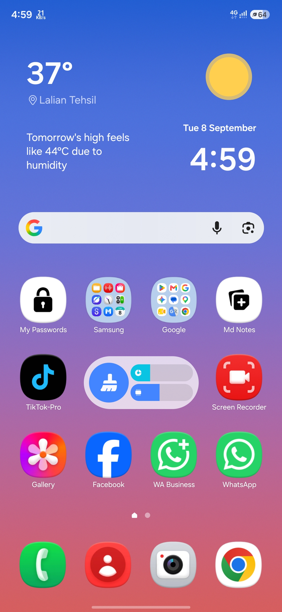

<div align="center">
  
  <h1>ScreenRecorder</h1>

  <p>
    <a href="https://apt.izzysoft.de/fdroid/index/apk/com.haseeb.recorder">
      
    </a>
    <br><br>
    <a href="https://github.com/muhammadhaseebiqbal-dev/Screen-Recorder/stargazers">
      
    </a>
    &nbsp;&nbsp;
    <a href="https://github.com/muhammadhaseebiqbal-dev/Screen-Recorder/releases">
      
    </a>
    &nbsp;&nbsp;
    <a href="obtainium://add/https://github.com/muhammadhaseebiqbal-dev/Screen-Recorder">
      
    </a>
  </p>

  <p>
    <a href="https://www.patreon.com/MuhammadHaseebIqbal/posts/buy-me-coffee-162409817?utm_medium=clipboard_copy&utm_source=copyLink&utm_campaign=postshare_creator&utm_content=join_link">
      
    </a>
    &nbsp;&nbsp;
    <a href="https://www.patreon.com/ameermuawiyapk/posts/buy-me-coffee-168910489">
      
    </a>
  </p>

  <p><b>Minimal • Fast • Material 3 Expressive Screen Recorder for Android</b></p>
</div>

---

## 📸 Screenshots

<div align="center">
  <table>
    <tr>
      <td align="center"></td>
      <td align="center"></td>
    </tr>
    <tr>
      <td align="center"><b>Home & Library</b></td>
      <td align="center"><b>Floating Overlay</b></td>
    </tr>
    <tr>
      <td align="center"></td>
      <td align="center"></td>
    </tr>
    <tr>
      <td align="center"><b>Countdown</b></td>
      <td align="center"><b>Recording Settings</b></td>
    </tr>
    <tr>
      <td align="center"></td>
      <td align="center"></td>
    </tr>
    <tr>
      <td align="center"><b>Quick Settings</b></td>
      <td align="center"><b>About</b></td>
    </tr>
    <tr>
      <td align="center"></td>
      <td align="center"></td>
    </tr>
    <tr>
      <td align="center"><b>Adaptive Icon</b></td>
      <td align="center"><b>App Icon</b></td>
    </tr>
  </table>
</div>

---

## Features

### Recording

- 🎥 High-quality screen recording with flexible recording options
- 🎞️ Multiple video codec options for better compatibility and compression
- 🎚️ FPS controls with multiple frame rate options
- 📊 Bitrate controls with automatic and manual settings
- 🔄 Screen orientation controls for different recording layouts
- 🎙️ Audio source controls for internal audio and microphone recording
- 🎚️ Audio quality controls with multiple sample rate options
- ⏱️ Customizable countdown before recording starts
- ⏸️ Pause and resume recordings whenever you need
- 📁 Custom storage location for easy file management

### Floating Controls

- 🧭 Radial floating controls with a smooth circular layout
- ↔️ Horizontal floating controls with a compact docked layout
- 🎛️ Custom overlay controls to show only the buttons you need
- 📍 Edge docking keeps the floating controls out of the way
- ⏱️ Live recording timer displayed directly on the overlay
- 🔘 Quick controls for pause, mute, camera, drawing, and stopping

### Screen Drawing

- ✏️ Draw directly on the screen while recording
- 🖌️ Multiple drawing tools including pen, arrow, shapes, and eraser
- ↩️ Undo and redo support for quick corrections
- 🎨 Custom color selection for screen annotations
- 📏 Adjustable brush size for different drawing needs
- 👆 Touch-through mode lets you use the app underneath your annotations

### Shizuku Integration

- 👆 Automatically enable Show Taps while recording
- 📱 Automatically enable immersive mode for cleaner recordings
- 🔊 Enhanced internal audio routing through Shizuku
- 🚀 Start recording with fewer system confirmation steps

### Android Integration

- ⚡ Quick Settings tile for fast access to screen recording
- 🔔 Recording controls directly from the Android notification
- 📲 Native MediaProjection-based screen recording
- 🎨 Material 3 Expressive interface with dynamic system colors
- 🌐 Built-in language selection for supported languages
- ℹ️ About screen with app information, licenses, contributors, and updates

### Languages

- 🌍 Multiple language support with easy in-app language switching
  - English
  - اردو (Urdu)
  - العربية (Arabic)
  - Español (Spanish)
  - Français (French)
  - Deutsch (German)
  - 日本語 (Japanese)
  - Português (Portuguese)
  - Русский (Russian)
  - Türkçe (Turkish)
  - हिन्दी (Hindi)
  - 简体中文 (Simplified Chinese)

---

## Build Requirements

- Android Studio: Ladybug / Meerkat or newer
- Android SDK 36
- Minimum SDK 26
- Gradle 9+
- Java 17

---

## Support & Contributions

If you find ScreenRecorder useful, you can support its development.

<table align="center">
  <tr>
    <td align="center" width="50%">
      <b>Muhammad Haseeb</b><br/>
      <sub>Founder & Lead Developer</sub><br/><br/>
      <a href="https://www.patreon.com/MuhammadHaseebIqbal/posts/buy-me-coffee-162409817?utm_medium=clipboard_copy&utm_source=copyLink&utm_campaign=postshare_creator&utm_content=join_link">
        
      </a>
    </td>
    <td align="center" width="50%">
      <b>Ameer Muawiya</b><br/>
      <sub>Principal Architect & Lead Contributor</sub><br/><br/>
      <a href="https://www.patreon.com/ameermuawiyapk/posts/buy-me-coffee-168910489">
        
      </a>
    </td>
  </tr>
</table>

---

## License

```text
MIT License

Copyright (c) 2024 Muhammad Haseeb

Permission is hereby granted, free of charge, to any person obtaining a copy
of this software and associated documentation files (the "Software"), to deal
in the Software without restriction, including without limitation the rights
to use, copy, modify, merge, publish, distribute, sublicense, and/or sell
copies of the Software, and to permit persons to whom the Software is
furnished to do so, subject to the following conditions:

The above copyright notice and this permission notice shall be included in all
copies or substantial portions of the Software.

THE SOFTWARE IS PROVIDED "AS IS", WITHOUT WARRANTY OF ANY KIND, EXPRESS OR
IMPLIED, INCLUDING BUT NOT LIMITED TO THE WARRANTIES OF MERCHANTABILITY,
FITNESS FOR A PARTICULAR PURPOSE AND NONINFRINGEMENT. IN NO EVENT SHALL THE
AUTHORS OR COPYRIGHT HOLDERS BE LIABLE FOR ANY CLAIM, DAMAGES OR OTHER
LIABILITY, WHETHER IN AN ACTION OF CONTRACT, TORT OR OTHERWISE, ARISING FROM,
OUT OF OR IN CONNECTION WITH THE SOFTWARE OR THE USE OR OTHER DEALINGS IN THE
SOFTWARE.
```
